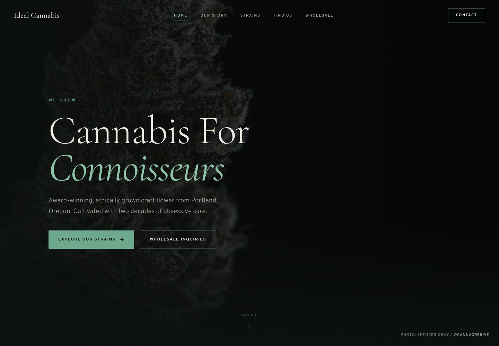

# Ideal Cannabis Website

## 🚀 Live Demo

**[View the production site](https://ideal-cannabis-website.vercel.app/)**



A portfolio-ready brand website for an Oregon craft cannabis producer. The experience pairs editorial typography and original cannabis photography with a responsive product catalog, strain filters, detailed cultivar profiles, retail guidance, and a wholesale inquiry path.

> Designed, developed, and photographed by [CannaCre8ive](https://cannacre8ive.com). This repository preserves the supplied single-file prototype in `source/` and packages a production-ready static release.

## Highlights

- Multi-view single-page experience with shareable hash navigation
- Responsive layouts from 320px mobile through large desktop displays
- Six-strain catalog with cultivation and type filters
- Accessible keyboard-operated strain cards and detail dialogs
- Wholesale inquiry validation with a pre-filled email handoff
- Localized photography for reliable deployment
- Search, social sharing, crawler, favicon, and canonical metadata
- Reduced-motion support and visible keyboard focus states

## Quick Start

No build step or environment variables are required.

```bash
npm run serve
```

Then open `http://localhost:4173`.

Run the release audit with:

```bash
npm run check
```

## Architecture Overview

This is a deliberately lightweight static application. `index.html` contains the semantic markup, styles, strain dataset, filtering, modal behavior, form validation, and hash-based page routing. Photography is served from `assets/images/`; Vercel serves the repository root with security and cache headers defined in `vercel.json`.

See [ARCHITECTURE.md](ARCHITECTURE.md) for the technical blueprint and [USERFLOW.md](USERFLOW.md) for interaction paths.

## Repository Guide

```text
.
├── assets/images/          Production photography
├── documentation/assets/  Repository and social screenshots
├── scripts/                Dependency-free release audit
├── source/                 Untouched supplied prototype
├── index.html              Production entry point
├── social-preview.png      1200 × 630 social share image
├── vercel.json             Hosting and response-header configuration
└── *.md                    Product, design, testing, and release context
```

## Portfolio Context

This release demonstrates brand strategy, art direction, photography, responsive web design, front-end development, product storytelling, merchandising, and deployment discipline in one compact project. A concise case-study outline and reusable project summary are available in [PORTFOLIO.md](PORTFOLIO.md).

## Important Content Boundary

Business, product, potency, licensing, availability, retailer, and contact claims were retained from the supplied prototype. They were not independently verified during repository packaging and should be confirmed by the site owner before using this as a current commercial website. The newsletter interaction is a demonstration state; it does not submit data to a provider.

## Recent Updates

### 1.0.0 — 2026-09-02

- Preserved the original prototype and packaged a standalone production release.
- Localized all photography and added accessibility, SEO, and social sharing essentials.
- Added complete product, design, architecture, user-flow, testing, contribution, attribution, and portfolio documentation.
- Added desktop, mobile, and 1200 × 630 social preview assets captured from the stable production origin.

See [CHANGELOG.md](CHANGELOG.md) for the full release record.

## Rights and Attribution

Photography and brand materials remain the property of their respective rights holders. No open-source license is granted by this repository. See [ATTRIBUTION.md](ATTRIBUTION.md).
